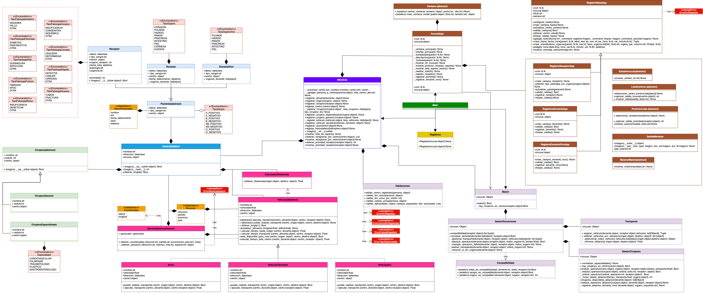

# **Trabajo final**

### Materia: Laboratorio de programación 1

### Integrantes:

```
Juana Larrumbide 
GitHub: Juana2004

Teresa Moraiz Magadan 
GitHub: teremoraiz
```

### Comisión: Lunes

### Coach: Camila Zavidowski

### Profesor: Fernando Mario Romero Munoz




Este proyecto simula el sistema de gestión que podría utilizar el INCUCAI, encargado de coordinar la donación y el trasplante de órganos y tejidos en Argentina.
El sistema permite registrar centros de salud, vehículos, cirujanos, donantes y receptores, gestionar listas de espera, asignar órganos de forma automatizada y simular la logística del transporte y operación médica.
Está pensado como una herramienta que reproduce el proceso detrás de cada trasplante, desde la detección del donante hasta la realización de la cirugía.

## Instalación

Abrir carpeta de preferencia en Visual Studio Code y ejecutar en terminal:

```bash
git clone https://github.com/Juana2004/SRC.git
cd src
python -m venv venv

Windows:
venv\Scripts\activate

MacOS/Linux:
source venv/bin/activate

pip install -r requirements.txt
python main.py
```

### Formato utilizado

Para este proyecto se utilizó la extensión Black Formatter, utilizada comúnmente en proyectos en Python + Estilos de código vistos en clase.

## Interfaz

El sistema cuenta con una interfaz gráfica desarrollada en Tkinter, que permite una interacción sencilla y directa con las funcionalidades principales del programa, sin necesidad de acceder al código.

### Desde la interfaz se puede:

* Ver el estado del INCUCAI: Cantidad de vehículos, cirujanos, donantes, receptores y centros de salud. La lista de donantes y receptores.
* Registrar donantes (vivos o fallecidos).
* Registrar receptores.
* Consultar la prioridad de un receptor en la lista de espera.
* Ver los receptores registrados en un centro de salud específico.
* Ejecutar el algoritmo de *matching*, que muestra el resultado del proceso completo: desde la asignación del órgano hasta la operación.
  Esta interfaz está diseñada para facilitar la prueba y la visualización del sistema sin necesidad de conocimiento.

### Tener en cuenta:

Por cada ejecución del código se entiende que es un nuevo día, una vez hecho el *match* los cirujanos utilizados se marcan como que operaron hoy, si se vuelve a correr el *match* no estarán disponibles esos cirujanos. Los vehículos utilizados tendrán su ubicación actualizada, no tendrán la que fue inicializada y su contador de viajes será mayor a 0. Por su parte, los receptores y donantes podrán o no estar, dependiendo de si tuvieron una operación exitosa o no, y para el caso de los donantes, los fallecidos; la hora de ablación de sus órganos ya estaría asignada con su hora de fallecimiento, para los vivos; la hora de ablación del órgano se asigna una vez hecha la ablación, por lo tanto, aunque haya donado un órgano antes, los demás no tendrán asignada una hora aún.

### Implementación de librería GeoPy

Para la gestión de transporte dentro del sistema de trasplantes, se utilizó la librería GeoPy de Python, la cual permite realizar operaciones geográficas a partir de coordenadas (latitud y longitud).

* Funcionalidades implementadas con GeoPy:

  * Asignación inicial de ubicaciones:

    * A cada centro de salud y vehículo se le asigna una ubicación geográfica del tipo {Dirección, Partido, Provincia, País}, para uso eficiente se recomienda escribir direcciones reales y contar con una velocidad mínima de internet de 1–5 Mbps ya que se convierten direcciones a coordenadas: geocodificación, para esto se consulta al servicio Nominatim.
  * Se utiliza GeoPy para calcular la distancia en kilómetros entre:

    * **Tener en cuenta:** El cálculo realizado es entre dos coordenadas, GeoPy **no** simula la ruta real como si fuera un GPS.
    * Dos centros de salud.
    * Un centro y un vehículo.
    * La ruta de un vehículo en movimiento (para estimar tiempos de llegada).
  * Actualización de ubicación:
    Cada vez que un vehículo inicia un viaje para transportar un órgano, su posición se actualiza al llegar al destino. Este comportamiento se simula mediante el cálculo de distancias y la actualización de coordenadas.

### Nota sobre GeoPy

A pesar de tener una conexión baja, internamente GeoPy realiza los cálculos a partir de coordenadas por lo que las ubicaciones sí se actualizan, solo que la geocodificación no funcionaría por eso no se podría imprimir la nueva dirección. A pesar de eso, para mayor orden de código, si al momento de registrar un objeto de tipo Vehículo o CentroDeSalud no se logra geocodificar, este no se registrará, y por consecuencia, como todas las demás clases son composición de CentroDeSalud, tampoco se registrarán. En cambio, al momento de actualizar la ubicación de un vehículo, si no se logra geocodificar, el programa seguirá funcionando igual pero no se podrá ver la nueva ubicación de este, pero internamente GeoPy hará bien los cálculos de distancias.

## FUNCIONAMIENTO

* Ingreso de datos iniciales:

  * Receptores con grupo sanguíneo, edad y órgano necesario: Estos entran en una lista de espera ordenados por prioridad.

    * Prioridad:

      * Estado: estable/inestables. Al iniciar todos son estables, pasan a ser inestables si su operación falla.
      * Patología: hay preescritas en tipos/patologias.py aproximadamente 3/4 patologías dependiendo del órgano que se requiere, cada una puede tener prioridad media o baja, en caso de tener otra, se puede seleccionar "otra" y se contempla como prioridad baja.
      * Urgencia: Se entiende como un choque o accidente de ese tipo.
      * Fecha en que entró a la lista: Si todo lo anterior da la misma prioridad para dos receptores, estará primero el que entró antes a la lista.
  * Donantes vivos o fallecidos, con órganos disponibles.
  * Cirujanos (generales y especializados).
  * Centros de salud con ubicación geográfica (provincia, partido y localidad).
  * Vehículos terrestres, helicópteros y aviones, con ubicación geográfica (provincia, partido y localidad).
* Ejecución del algoritmo de *matching*:

  * Se buscan donantes compatibles con cada receptor según:

    * Grupo sanguíneo.
    * Órgano disponible.
    * Edad compatible.
      **Nota**: Los criterios utilizados fueron los más parecidos a la realidad, se pueden ver en el archivo sistema/compatibilidad.py
  * Se verifica que haya cirujanos disponibles en los centros tanto del donante como del receptor: Uno realizará la ablación y otro el trasplante del órgano.
  * Si los centros son distintos, se evalúa la logística de transporte: Se asegura que haya un vehículo del tipo necesitado que pertenezca al centro del donante o del receptor.
* Ablación:

  * Se realiza la ablación (extracción del órgano).
  * Si el donante es vivo, la hora de ablación se asigna en ese momento; si es fallecido, se usa la hora de muerte.
* Transporte de órganos:

  * Se calcula la distancia entre centros mediante coordenadas.
  * Se escoge el vehículo más eficiente según:

    * Distancia.
    * Velocidad.
    * Tráfico (para vehículos terrestres).
    * Disponibilidad (solo se usan vehículos del centro del donante o del receptor).
      **Nota:** El cálculo realizado es distancia/velocidad = tiempo, en caso de ser terrestre el tráfico es calculado con un random.
  * El vehículo seleccionado se desplaza, se actualiza su ubicación y contador de viajes.
* Resultado de la operación:

  * Se asegura que el órgano no supere las 20 horas de viabilidad desde la ablación hasta el trasplante contando el tiempo de transporte.
  * Si se supera, el órgano se descarta y el receptor vuelve a la posición 1 de la lista de espera.
  * Se evalúa la operación con una probabilidad de éxito, influida por si el cirujano es general o especializado.

    * Si la operación es exitosa:

      * Se elimina el receptor del sistema.
      * Se verifica si el donante tiene más órganos para seguir donando, en caso contrario, se elimina.
    * Si la operación falla:

      * El órgano se descarta.
      * El receptor vuelve a la lista de espera a la posición 1.
      * El donante se conserva si tiene más órganos viables.

## Métodos mágicos utilizados

* `__eq__` : utilizado en las clases Cirujano: compara si dos cirujanos tienen misma cédula, Centro de salud: compara si dos centros tienen mismo nombre y dirección, y Paciente: compara si dos pacientes tienen mismo DNI.

* `__hash__` : utilizado en Centro de salud: devuelve un número entero que representa de manera única a un objeto, Python primero compara los *hashes* para ver si puede evitar usar `__eq__`, que es menos eficiente.

* `__lt__` : Compara dos receptores para definir cuál tiene mayor prioridad, luego se usa `sort()` sobre la lista de estos y los ordena automáticamente.

* `__str__` : Utilizado en INCUCAI, muestra el estado del INCUCAI solo con imprimir el objeto.

* Utilizado en salida\_metodos:

  * `__enter__` : Para preparar el recurso que se va a usar en el bloque `with`, redirige la salida estándar (`print`) al buffer interno.

  * `__exit__` : Se ejecuta al salir del bloque `with` para restaurar la salida estándar al valor original.
